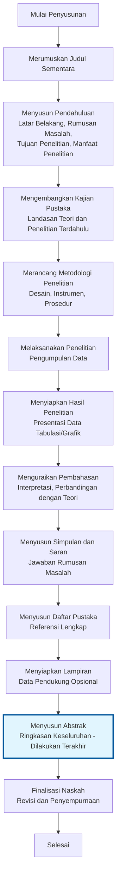

# 📘 Modul Ajar Minggu 3

**Mata Kuliah:** Bahasa Indonesia
**Minggu:** 3
**Topik:** Mengenal Karya Tulis Ilmiah

---

## 🎯 CPMK (Capaian Pembelajaran Mata Kuliah) Minggu 3

Setelah mengikuti pembelajaran Minggu 3, mahasiswa mampu:

1. Menjelaskan definisi karya tulis ilmiah menurut berbagai ahli.
2. Mengidentifikasi ciri-ciri karya tulis ilmiah yang membedakannya dari karya non-ilmiah.
3. Mendeskripsikan bentuk-bentuk karya ilmiah (makalah, laporan, artikel, skripsi, tesis, disertasi).
4. Menyadari manfaat menulis karya ilmiah bagi pengembangan keilmuan dan karier akademik.
5. Menunjukkan sikap ilmiah dalam menulis (jujur, objektif, kritis, sistematis).
6. Menyusun format karya ilmiah sesuai standar (abstrak, pendahuluan, kajian pustaka, metodologi, hasil, pembahasan, simpulan, daftar pustaka).
7. Menerapkan konsep *general–specific text* dalam penyusunan paragraf karya ilmiah.

---

## 1. Pendahuluan 

Karya ilmiah adalah produk tertinggi dari kegiatan akademik. Mahasiswa tidak hanya dituntut memahami materi kuliah, tetapi juga mampu mengekspresikan pemahaman itu dalam bentuk tulisan ilmiah yang dapat diuji, dikritisi, dan dipublikasikan. Dalam dunia pendidikan tinggi, karya ilmiah menjadi tolok ukur kemampuan berpikir kritis, sistematis, dan logis.

Banyak mahasiswa merasa menulis karya ilmiah itu sulit. Kesulitan ini sering muncul bukan karena tidak memiliki ide, tetapi karena kurang memahami apa itu karya ilmiah, bagaimana ciri dan formatnya, serta bagaimana menyusun argumen secara terstruktur. Oleh karena itu, minggu ke-3 diarahkan untuk memperkenalkan dasar-dasar karya ilmiah: definisi, ciri, bentuk, manfaat, sikap penulis, hingga format penulisan.

---

## 2. Uraian Materi

### 2.1 Pengertian Karya Tulis Ilmiah

Beberapa definisi:

* **Keraf (2001):** karya ilmiah adalah tulisan yang menyajikan hasil pemikiran atau penelitian dengan metode tertentu, sistematis, dan dapat diuji.
* **Sardy (2005):** karya ilmiah adalah karangan yang disusun berdasarkan hasil penelitian, kajian pustaka, atau pemikiran yang memenuhi kaidah ilmiah.
* **Agus Nero Sofyan dkk. (2007):** karya ilmiah adalah tulisan akademik yang menggunakan bahasa Indonesia baku, berdasarkan data, logis, sistematis, dan bersifat objektif.

Intinya: karya ilmiah adalah **tulisan akademik yang disusun dengan metode ilmiah, menggunakan bahasa baku, sistematis, logis, objektif, dan dapat dipertanggungjawabkan**.

---

### 2.2 Ciri-Ciri Karya Tulis Ilmiah

1. **Objektif** – berbasis fakta dan data, bukan opini personal.
2. **Sistematis** – struktur baku (abstrak, pendahuluan, metodologi, hasil, diskusi, simpulan).
3. **Logis** – sesuai alur berpikir yang benar.
4. **Baku** – menggunakan bahasa Indonesia baku (EYD/PUEBI).
5. **Terverifikasi** – bisa diuji ulang atau dikritisi.
6. **Kritis** – membandingkan teori, memberi analisis.
7. **Universal** – ditujukan untuk masyarakat ilmiah luas.

---

### 2.3 Bentuk Karya Ilmiah

1. **Makalah** – tugas kuliah, hasil kajian pustaka.
2. **Artikel ilmiah** – tulisan pendek untuk jurnal/seminar.
3. **Laporan penelitian** – hasil penelitian lapangan/lab.
4. **Proposal penelitian** – rencana penelitian.
5. **Skripsi, tesis, disertasi** – karya akhir jenjang S1, S2, S3.
6. **Paper konferensi** – naskah ilmiah dipresentasikan.

---

### 2.4 Manfaat Karya Ilmiah

1. Melatih berpikir kritis dan sistematis.
2. Menjadi sarana komunikasi akademik.
3. Membangun budaya literasi ilmiah.
4. Menjadi tolok ukur kompetensi akademik mahasiswa.
5. Kontribusi nyata terhadap ilmu pengetahuan dan masyarakat.

---

### 2.5 Sikap dalam Menulis Karya Ilmiah

* **Jujur**: tidak memanipulasi data, tidak plagiarisme.
* **Objektif**: tidak bias pribadi.
* **Kritis**: mempertanyakan, membandingkan teori.
* **Sistematis**: teratur dari pendahuluan sampai simpulan.
* **Terbuka**: siap dikritisi.

---

### 2.6 Format Karya Ilmiah

Umumnya karya ilmiah terdiri dari:
Baik, berikut penjelasan rinci setiap bagian karya ilmiah beserta contohnya. Masing-masing bagian dijelaskan secara ringkas namun informatif (≥100 kata) agar sesuai dengan kebutuhan akademik dan format yang umum digunakan di perguruan tinggi.

***

#### A. Judul
Judul adalah pernyataan singkat yang menggambarkan inti atau fokus utama dari penelitian. Judul harus spesifik, mencerminkan variabel yang diteliti, serta mudah dipahami. Dalam karya ilmiah, judul sering kali menjadi faktor pertama yang menentukan apakah pembaca tertarik membaca lebih lanjut. Judul yang baik tidak boleh terlalu panjang, maksimal 12–15 kata, dan menggunakan istilah ilmiah yang relevan. Misalnya, penelitian tentang pengaruh penggunaan perangkat jaringan terhadap performa sistem harus mencerminkan hubungan sebab-akibat secara eksplisit.  

**Contoh:** “Analisis Pengaruh Konfigurasi VLAN terhadap Keamanan dan Efisiensi Jaringan Kampus di PENS”

***

#### B. Abstrak
Abstrak merupakan ringkasan singkat dari keseluruhan isi karya ilmiah, biasanya terdiri dari 150–250 kata. Fungsinya memberi gambaran umum tentang tujuan, metode, hasil, dan kesimpulan penelitian tanpa harus membaca seluruh naskah. Abstrak harus ditulis secara padat, jelas, dan objektif. Dalam beberapa jurnal, abstrak juga mencakup kata kunci (keywords) yang memudahkan indexing penelitian di basis data akademik.  

**Contoh:**  
Penelitian ini menganalisis pengaruh konfigurasi VLAN terhadap keamanan jaringan kampus. Metode eksperimental digunakan dengan menerapkan skenario segmentasi jaringan menggunakan perangkat Mikrotik. Hasil penelitian menunjukkan bahwa penerapan VLAN dapat menurunkan risiko serangan ARP spoofing hingga 65% serta meningkatkan efisiensi bandwidth antar departemen. Penelitian ini memberikan rekomendasi desain jaringan aman untuk institusi pendidikan. *Kata kunci: VLAN, keamanan jaringan, Mikrotik.*

***

#### C. Pendahuluan
Bagian pendahuluan menjelaskan latar belakang, rumusan masalah, tujuan, dan manfaat penelitian. Tujuannya untuk memperlihatkan mengapa topik tersebut penting diteliti dan bagaimana relevansinya terhadap konteks akademik atau praktis. Latar belakang menggambarkan kondisi nyata yang mendorong penelitian dilakukan, diikuti dengan perumusan masalah (pertanyaan penelitian) serta tujuan yang ingin dicapai. Manfaat berisi kontribusi ilmiah maupun praktis dari hasil penelitian.  

**Contoh:**  
Latar belakang: Meningkatnya ancaman keamanan jaringan di perguruan tinggi menuntut solusi efektif melalui segmentasi VLAN.  
Rumusan masalah: Bagaimana pengaruh penerapan VLAN terhadap keamanan jaringan kampus?  
Tujuan: Menganalisis hubungan konfigurasi VLAN dengan peningkatan keamanan jaringan.  
Manfaat: Memberi panduan implementasi keamanan jaringan bagi institusi pendidikan.

***

#### D. Kajian Pustaka
Kajian pustaka (tinjauan teori) berisi uraian teori, konsep, serta penelitian terdahulu yang relevan dengan topik. Tujuannya memberikan landasan teoretis dan menunjukkan posisi penelitian terhadap studi sebelumnya. Dalam bagian ini penulis menampilkan rujukan dari buku, jurnal, maupun artikel ilmiah kredibel. Kajian pustaka membantu pembaca memahami konteks ilmiah penelitian dan menghindari duplikasi.  

**Contoh:**  
Penelitian oleh Siregar (2023) menunjukkan bahwa VLAN dapat memisahkan lalu lintas antar divisi untuk mencegah serangan internal. Selain itu, studi oleh Rahman (2022) menyoroti peningkatan performa jaringan dengan konfigurasi VLAN dinamis berbasis Mikrotik. Dengan mengacu pada kedua studi tersebut, penelitian ini berupaya memperluas penerapan VLAN pada skala kampus dengan parameter keamanan dan efisiensi yang lebih komprehensif.

***

#### E. Metodologi
Metodologi menjelaskan cara penelitian dilakukan, termasuk desain penelitian, variabel, instrumen, teknik pengumpulan data, dan prosedur analisis. Tujuannya agar penelitian dapat direplikasi oleh orang lain dengan hasil yang konsisten. Jenis metode dapat berupa kualitatif, kuantitatif, atau kombinasi keduanya tergantung tujuan penelitian.  

**Contoh:**  
Penelitian ini menggunakan metode eksperimen dengan dua skenario jaringan: tanpa VLAN dan dengan VLAN. Perangkat Mikrotik digunakan untuk konfigurasi segmentasi, sementara Wireshark digunakan untuk memantau paket data. Data performa jaringan (delay, throughput, packet loss) dikumpulkan selama 7 hari dan dianalisis menggunakan uji t untuk melihat signifikansi perbedaan antara kedua skenario.

***

#### F. Hasil Penelitian
Bagian hasil menampilkan temuan utama dari proses penelitian tanpa interpretasi berlebihan. Hasil biasanya disajikan dalam bentuk tabel, grafik, atau bagan agar lebih mudah dipahami. Hasil harus sesuai dengan rumusan masalah dan metode penelitian.  

**Contoh:**  
Dari pengujian jaringan, diperoleh bahwa rata-rata jumlah serangan ARP request menurun dari 230 menjadi 78 per jam setelah penerapan VLAN. Efisiensi bandwidth meningkat 27% pada jam sibuk, dan delay antar divisi mengalami penurunan signifikan. Data ini menunjukkan adanya peningkatan kinerja dan keamanan yang terukur.

***

#### G. Pembahasan
Pembahasan menginterpretasikan hasil penelitian dengan mengaitkannya pada teori dan studi terdahulu. Pada bagian ini penulis menjelaskan makna dari data, alasan munculnya pola tertentu, serta perbandingan dengan hasil penelitian lain. Pembahasan juga digunakan untuk menguji hipotesis.  

**Contoh:**  
Penurunan serangan internal setelah penerapan VLAN menunjukkan efektivitas segmentasi jaringan dalam membatasi akses antar subnet. Hasil ini mendukung temuan Rahman (2022) serta memperluas bukti ilmiah bahwa isolasi jaringan dapat meminimalkan risiko serangan rekonstruksi ARP. Namun, konfigurasi VLAN perlu disertai kebijakan routing yang aman agar tidak menimbulkan bottleneck antar-segmen.

***

#### H. Simpulan dan Saran
Simpulan merangkum hasil penelitian yang relevan dengan tujuan awal. Ia harus ringkas dan menyajikan jawaban terhadap rumusan masalah. Saran mencakup rekomendasi untuk penelitian lanjutan atau implementasi praktis berdasarkan hasil penelitian.  

**Contoh:**  
Simpulan: Penerapan VLAN berbasis Mikrotik terbukti meningkatkan keamanan dan efisiensi jaringan kampus.  
Saran: Penelitian lanjutan disarankan untuk mengevaluasi penggunaan VLAN dinamis dengan autentikasi RADIUS untuk menambah lapisan kontrol akses pada jaringan pendidikan.

***

#### I. Daftar Pustaka
Daftar pustaka berisi semua sumber yang dirujuk dalam karya ilmiah. Format penulisan mengikuti standar tertentu seperti APA, IEEE, atau Harvard. Fungsinya menunjukkan dasar teori yang digunakan sekaligus menghormati hak cipta penulis lain.  

**Contoh (APA Style):**  
Siregar, A. (2023). *Analisis Efisiensi VLAN dalam Keamanan Jaringan*. Jurnal Teknologi Informasi, 15(2), 112–118.  
Rahman, M. (2022). *Implementasi VLAN Dinamis pada Jaringan Mikrotik Kampus*. Prosiding Seminar Nasional Informatika, 9(1), 55–62.

***

#### J. Lampiran
Lampiran berisi data pendukung yang terlalu rinci untuk ditempatkan pada bagian utama, seperti kuesioner, hasil log eksperimen, skrip konfigurasi, atau tabel besar. Lampiran membantu pembaca yang ingin menelusuri proses penelitian secara lebih teknis.  

**Contoh:**  
Lampiran A: Skrip konfigurasi VLAN Mikrotik  
Lampiran B: Log hasil monitoring jaringan (format .csv)  
Lampiran C: Screenshot topologi laboratorium uji VLAN  

***

## Diagram Alur Penyusunan Karya Ilmiah

Berikut disajikan diagram alur penyusunan karya ilmiah secara formal, dengan penulisan **abstrak dilakukan terakhir** setelah seluruh bagian isi telah selesai dan disempurnakan. Urutan ini mengikuti praktik akademik standar untuk memastikan abstrak mencerminkan substansi penelitian secara akurat.

**Penjelasan Alur Penyusunan**
Mengapa Abstrak Terakhir?
1. Abstrak memerlukan gambaran lengkap semua bagian yang sudah selesai
2. Menghindari perubahan berulang saat konten utama direvisi
3. Memastikan konsistensi antara ringkasan dan isi sebenarnya
   
### 2.6.2. Urutan Logis Penyusunan

1. **Judul Sementara**: Dirumuskan awal sebagai panduan fokus penelitian, dapat disempurnakan di akhir.
2. **Pendahuluan**: Menyajikan konteks masalah, rumusan, tujuan, dan manfaat untuk membingkai penelitian.
3. **Kajian Pustaka**: Menguraikan fondasi teoretis dan celah penelitian terdahulu.
4. **Metodologi**: Mendefinisikan prosedur ilmiah yang dapat direplikasi.
5. **Pelaksanaan Penelitian**: Tahap empiris pengumpulan data primer.
6. **Hasil Penelitian**: Presentasi temuan objektif tanpa interpretasi.
7. **Pembahasan**: Analisis mendalam dan kaitan dengan literatur.
8. **Simpulan dan Saran**: Sintesis akhir dan rekomendasi aplikatif.
9. **Daftar Pustaka**: Dokumentasi rujukan sistematis.
10. **Lampiran**: Materi suplemen untuk verifikasi.
11. **Abstrak**: Dirangkum belakangan setelah isi matang, mencakup keseluruhan esensi (150-250 kata).

Pendekatan ini memastikan koherensi dan integritas ilmiah, sesuai pedoman penulisan karya ilmiah.

---

### 2.7 General–Specific Text

Salah satu teknik dalam penulisan ilmiah adalah **general–specific text**:

* Paragraf dimulai dari pernyataan umum (general).
* Diikuti rincian/penjelasan khusus (specific).
* Ditutup simpulan atau penghubung ke paragraf berikut.

Contoh:

* General: *“Teknologi informasi berkembang pesat di era modern.”*
* Specific: *“Perkembangan ini tampak pada penggunaan internet, smartphone, dan media sosial yang memengaruhi pola komunikasi.”*
* Concluding: *“Oleh karena itu, penelitian ini mengkaji dampak media sosial terhadap literasi mahasiswa.”*

---

## 3. Contoh Analisis

* **Karya populer:** *“Banjir di kota ini bikin masyarakat panik dan ribut.”*
* **Karya ilmiah:** *“Banjir yang melanda kota X pada Januari 2023 menyebabkan kerugian sosial dan ekonomi signifikan. Data BNPB menunjukkan 2.500 rumah terdampak dan 15 sekolah tidak dapat beroperasi.”*

Analisis: perbedaan terletak pada penggunaan data, gaya bahasa baku, objektivitas, dan struktur.

---

## 4. Latihan

1. Tuliskan definisi karya ilmiah menurut 3 sumber berbeda.
2. Sebutkan 5 ciri karya ilmiah dan berikan contohnya.
3. Identifikasi bagian karya ilmiah dalam sebuah artikel jurnal yang Anda baca.
4. Susun satu paragraf dengan pola general–specific text.
5. Bandingkan 1 berita populer dan 1 artikel ilmiah, lalu jelaskan perbedaannya.

---

## 5. Mini Project

Mahasiswa diminta menulis **draft makalah ilmiah singkat (2–3 halaman)** dengan format: judul, pendahuluan, kajian pustaka singkat (2 referensi), metodologi (deskriptif), pembahasan (analisis sederhana), dan simpulan. Tujuannya melatih struktur dasar karya ilmiah.

---

## 6. Rangkuman

* Karya ilmiah adalah tulisan akademik dengan kaidah ilmiah.
* Ciri: objektif, sistematis, logis, baku, kritis, universal.
* Bentuk: makalah, artikel, laporan, skripsi, tesis, disertasi.
* Manfaat: melatih berpikir kritis, sarana komunikasi ilmiah, kontribusi akademik.
* Sikap: jujur, objektif, kritis, terbuka.
* Format baku: judul, abstrak, pendahuluan, kajian pustaka, metodologi, hasil, pembahasan, simpulan, daftar pustaka.
* Teknik penulisan: *general–specific text*.

---

## 7. Referensi

1. Agus Nero Sofyan, dkk. (2007). *Bahasa Indonesia dalam Penulisan Karya Ilmiah*. Bandung: Universitas Widyatama.
2. Sardy S. (2005). *Penulisan Karya Ilmiah & Etika Riset*. Jakarta: UAI.
3. R. Soedradjad. (2004). *Teknik Menulis Ilmiah*.
4. John Swales & Christine Feak. (2004). *Academic Writing for Graduate Students*.
5. Michael A. Morrison. (2004). *Tips on Scientific Writing*.
6. Kridalaksana, H. (2008). *Kamus Linguistik*.

---

