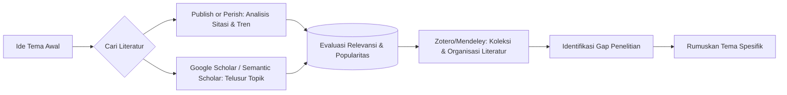
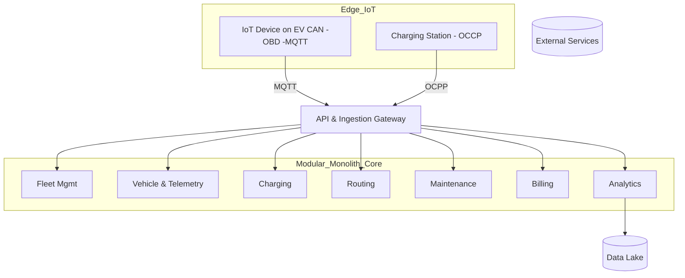

# 📘 Modul Ajar Minggu 4  
**Mata Kuliah:** Bahasa Indonesia  
**Minggu:** 4  
**Topik:** Pemilihan Tema Karya Ilmiah + Studi Kasus Arsitektur Sistem Kompleks (Modular Monolith Fleet EV)  

---

## 🎯 CPMK (Capaian Pembelajaran Minggu 4)  

Setelah mengikuti pembelajaran ini, mahasiswa mampu:  
1. Menjelaskan konsep tema penelitian/tema karya ilmiah.  
2. Mengidentifikasi kriteria tema yang baik: relevan, orisinal, bermanfaat, feasible, dan didukung literatur.  
3. Menggunakan alat bantu digital (Publish or Perish, mesin pencari topik ilmiah, Zotero, Mendeley) untuk memilih dan menyusun tema.  
4. Menyusun rumusan tema dalam bentuk draft judul penelitian.  
5. Memberi contoh tema dari berbagai bidang Teknik Informatika (Cyber Security, DevSecOps, ML & IoT, Arsitektur Modular Monolith untuk Fleet EV).  

---

## 1. Pendahuluan  

Pemilihan tema penelitian adalah **langkah awal paling krusial** dalam penyusunan karya ilmiah. Tema ibarat benih: jika dipilih dengan tepat, ia akan tumbuh menjadi penelitian yang kuat, bermanfaat, dan terarah.  

Namun, mahasiswa sering menghadapi dilema:  
- Tema terlalu luas → sulit difokuskan.  
- Tema terlalu sempit → tidak memberi kontribusi signifikan.  
- Tema mengikuti tren semata → kehilangan relevansi ilmiah.  

Minggu ini mahasiswa akan belajar cara memilih tema yang baik dengan **membantu diri menggunakan alat digital** untuk mengakses literatur dan tren riset terbaru, serta melihat **contoh nyata** dari berbagai domain Informatika, termasuk studi kasus arsitektur sistem Fleet Management EV dengan modular monolith.  

---

## 2. Uraian Materi  

### 2.1 Definisi Tema Penelitian  
- **Tema** = pokok pikiran besar/topik umum.  
- **Judul** = pernyataan spesifik yang menjadi arah penelitian.  

### 2.2 Kriteria Pemilihan Tema yang Baik  
1. **Relevan** → sesuai bidang studi dan isu aktual.  
2. **Orisinal** → belum banyak diteliti atau ada sudut pandang baru.  
3. **Bermanfaat** → kontribusi pada teori atau praktik.  
4. **Feasible** → sesuai kemampuan (waktu, biaya, sumber daya).  
5. **Didukung literatur** → tersedia referensi akademik.  

### 2.3 Sumber Inspirasi Tema  
- Fenomena sosial & teknologi.  
- Kajian pustaka.  
- Diskusi dengan dosen/ahli.  
- Pengalaman pribadi.  

### 2.4 Alat Bantu Digital dalam Pemilihan Tema  

#### 1. **Publish or Perish 8**  
Alat untuk mengekstrak data sitasi dari Google Scholar, Crossref, Scopus, dll.  
- Bisa mengevaluasi dampak tema (berapa banyak publikasi & sitasi).  
- Membantu melihat tren penelitian dari tahun ke tahun.  
- Website: [Harzing – Publish or Perish](https://harzing.com/resources/publish-or-perish)  

#### 2. **Mesin Pencari Topik Ilmiah & Studi Literatur**  
- **Google Scholar** ([scholar.google.com](https://scholar.google.com)) → pencarian artikel, kutipan, tren.  
- **Semantic Scholar** ([semanticscholar.org](https://www.semanticscholar.org)) → AI-based search, rekomendasi topik.  
- **Dimensions.ai** → tren penelitian dan grant.  

#### 3. **Zotero**  
Manajer referensi gratis & open-source.  
- Menyimpan literatur langsung dari browser.  
- Bisa memberi tag, anotasi, dan membuat bibliografi otomatis.  
- Referensi: [Zotero Wikipedia](https://en.wikipedia.org/wiki/Zotero)  

#### 4. **Mendeley**  
Manajer referensi milik Elsevier.  
- Menyediakan cloud untuk menyimpan PDF.  
- Sinkronisasi dengan Word untuk sitasi otomatis.  
- Ada fitur jejaring sosial riset.  
- Referensi: [Mendeley Wikipedia](https://en.wikipedia.org/wiki/Mendeley)  

---

### 2.5 Integrasi Alat Digital dalam Proses Pemilihan Tema  

---

## 3. Contoh  

### A. Sosial-Edukasi  
- Tema umum: *Media Sosial dan Pendidikan*.  
- Judul spesifik: *Pengaruh Intensitas Penggunaan TikTok terhadap Konsentrasi Belajar Mahasiswa Informatika Universitas X*.  

### B. Bidang Teknik Informatika  

#### 1. Cyber Security  
- **Tema umum:** IDS untuk serangan DDoS.  
- **Judul:** *Analisis Efektivitas Algoritma Random Forest dalam Mendeteksi Serangan DDoS menggunakan Dataset CICIDS2017*.  

#### 2. Sistem Informasi & DevSecOps  
- **Tema umum:** Integrasi keamanan DevOps.  
- **Judul:** *Implementasi DevSecOps untuk Meningkatkan Keamanan Aplikasi E-Learning Berbasis Cloud*.  

#### 3. Machine Learning & IoT untuk Kesehatan dan Sosial  
- **Tema umum:** Smart Healthcare dengan IoT.  
- **Judul:** *Implementasi IoT untuk Monitoring Denyut Jantung Pasien dengan Notifikasi Real-Time ke Aplikasi Mobile*.  

- **Tema umum:** Analisis sosial dengan ML.  
- **Judul:** *Analisis Sentimen Media Sosial tentang Program Vaksinasi COVID-19 Menggunakan Naïve Bayes Classifier*.  

#### 4. Arsitektur Sistem Kompleks – Modular Monolith Fleet EV  
- **Tema umum:** Arsitektur sistem manajemen armada kendaraan listrik.  
- **Judul:** *Evaluasi Modular Monolith vs Microservices pada Sistem Fleet EV: Studi Kompleksitas, Latensi, dan Biaya Operasional*.  

---

## 4. Analisis  

- **Tanpa alat digital:** tema generik, cenderung kurang spesifik.  
- **Dengan alat digital:** mahasiswa bisa mengukur tren (Publish or Perish), menemukan literatur relevan (Scholar/Semantic Scholar), mengelola referensi (Zotero/Mendeley), lalu menyusun tema yang fokus (mis. IDS untuk DDoS, DevSecOps untuk e-learning, IoT untuk pasien jantung, modular monolith untuk fleet EV).  

---

## 5. Latihan  

1. Gunakan **Publish or Perish** untuk mencari tren “DevSecOps” 5 tahun terakhir.  
2. Cari artikel tentang “IoT for Healthcare” di **Semantic Scholar**.  
3. Simpan minimal 5 literatur di **Zotero/Mendeley**, beri tag sesuai topik.  
4. Rumuskan 2 judul penelitian spesifik dari topik Cyber Security dan IoT Kesehatan.  
5. Buat diagram modul untuk sistem Fleet EV versi Anda.  

---

## 6. Mini Project  

Tugas kelompok:  
- Pilih 1 topik (Cyber Security / DevSecOps / ML & IoT / Arsitektur Fleet EV).  
- Gunakan **Publish or Perish + Google Scholar** untuk literatur.  
- Simpan di **Mendeley/Zotero**.  
- Susun draft judul penelitian (1 halaman) dan presentasikan.  

---

## 7. Rangkuman  

- Tema penelitian harus relevan, orisinal, bermanfaat, feasible, dan berbasis literatur.  
- Alat digital mempermudah eksplorasi tren dan organisasi literatur.  
- Contoh domain Informatika: **Cyber Security**, **DevSecOps**, **ML & IoT untuk kesehatan & sosial**, **Arsitektur Modular Monolith Fleet EV**.  
- Dengan pendekatan ini, mahasiswa dapat memilih tema berbasis bukti dan kebutuhan nyata.  

---

## 8. Referensi  

1. Agus Nero Sofyan, dkk. (2007). *Bahasa Indonesia dalam Penulisan Karya Ilmiah*. Bandung: Universitas Widyatama.  
2. Sardy S. (2005). *Penulisan Karya Ilmiah & Etika Riset*. Jakarta: UAI.  
3. R. Soedradjad. (2004). *Teknik Menulis Ilmiah*.  
4. Harzing, A.W. (2023). *Publish or Perish*. [https://harzing.com/resources/publish-or-perish](https://harzing.com/resources/publish-or-perish)  
5. Google Scholar. [https://scholar.google.com](https://scholar.google.com)  
6. Semantic Scholar. [https://www.semanticscholar.org](https://www.semanticscholar.org)  
7. Zotero. [https://en.wikipedia.org/wiki/Zotero](https://en.wikipedia.org/wiki/Zotero)  
8. Mendeley. [https://en.wikipedia.org/wiki/Mendeley](https://en.wikipedia.org/wiki/Mendeley)  

